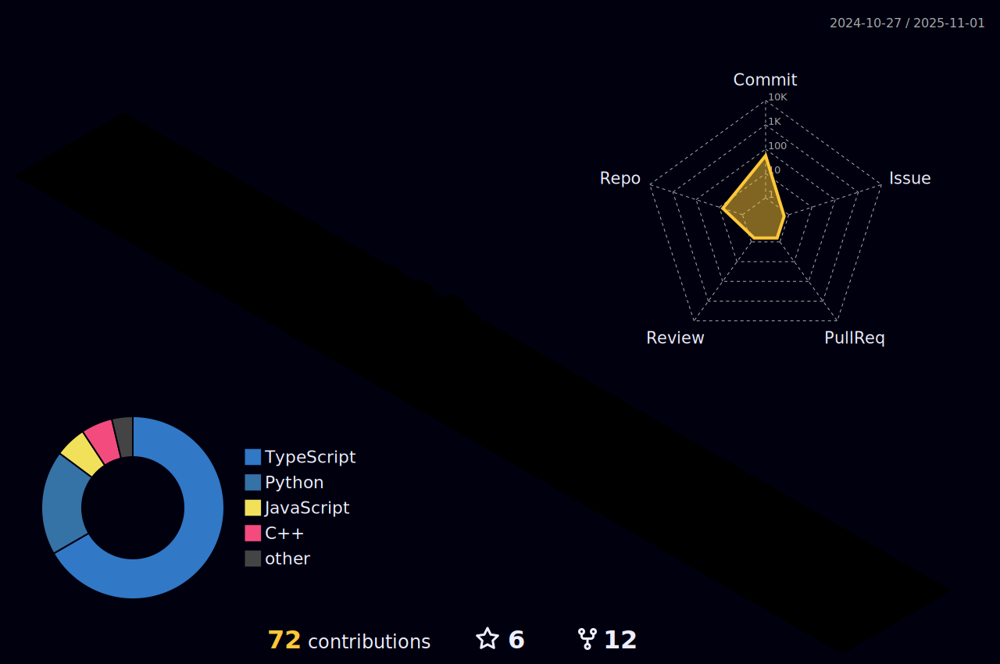

---

 <h3 align="left">A passionate ML engineer looking for a opportunity to grab an internship.</h3>

<h3 style="color: #0393d1;"><a href="https://colddsam.vercel.app/">portfolio website ↗️</a></h3>

## 🤓 About :

Hi, I'm Samrat Kumar Das from Kolkata, West Bengal. 
I'm in 3rd year of my BTech degree in Electronics and Communication Engineering which I pursuing from Narula Institute of Technology. 
I belive nothing is impossible if you think it possible. 
Currently I'm enhancing my skills in Machine Learning and Front End Development with which I want to proceed further. I love to work as a team and collaborate in open sources. 
Now I looking for an internship to applying and sharping my skills which I learning from my college and from my personal works.

## 🔎 Tech Stacks :

## 👽 Facts :

- 📃 My resume available at this [Link](https://drive.google.com/file/d/1PdT7z_OTmuz3gs02nRsrAx9_efc6rstA/view?usp=sharing)

- 🔭 I’m currently working on [Making a flutter based application](https://github.com/colddsam/virtual-assistant.git)

- 🌱 My present interest of learnings are **AI/ML, Front End**

- 👨‍💻 All of my projects are available at [Here](https://linktr.ee/colddsam?utm_source=linktree_profile_share&ltsid=2cda3886-be78-4ccf-a16a-3ef6943e4525)

- 💬 Ask me about: **AI/ML, Front End Development, Data Structure**

- 📫 To reach me just email at: **colddsam@gmail.com**

- ⚡ Self fact: **I believe the more we spread knowledge, the more we grow knowledge**

## 📖 Blogs :

<!-- Latest-blog-post:START -->
- [The Rise of Quantum Computing: A Paradigm Shift in Technology](https://colddsam.medium.com/the-rise-of-quantum-computing-a-paradigm-shift-in-technology-a7fd9c1de85a?source=rss-1f3fff14ffdd------2)
- [Decoding the Enigma of Quantum Computing: A Journey into the Subatomic Realm](https://colddsam.medium.com/decoding-the-enigma-of-quantum-computing-a-journey-into-the-subatomic-realm-ced1b791e884?source=rss-1f3fff14ffdd------2)
- [The Future of Programming: Quantum Computing Unveiled](https://colddsam.medium.com/the-future-of-programming-quantum-computing-unveiled-d77633d3a716?source=rss-1f3fff14ffdd------2)
- [Unlocking the Secrets of Algorithmic Trading: A Comprehensive Guide](https://colddsam.medium.com/unlocking-the-secrets-of-algorithmic-trading-a-comprehensive-guide-c2c79ee50a5a?source=rss-1f3fff14ffdd------2)
<!-- Latest-blog-post:END -->

## #️⃣ Socials :

<a href="https://www.linkedin.com/in/colddsam/" target="blank">
&nbsp;
<a href="https://www.instagram.com/colddsam/" target="blank">
&nbsp;
<a href="https://github.com/colddsam" target="blank">
&nbsp;
<a href="https://twitter.com/colddsam" target="blank">
&nbsp;
</a> 

## 📤 My Recent Activities:

<!--START_SECTION:activity-->

1. 🗣 Commented on [#1](https://github.com/colddsam/IIIT-RANCHI-HACKATHON-2023/pull/1#issuecomment-2241988435) in [colddsam/IIIT-RANCHI-HACKATHON-2023](https://github.com/colddsam/IIIT-RANCHI-HACKATHON-2023)
2. 🎉 Merged PR [#1](https://github.com/colddsam/IIIT-RANCHI-HACKATHON-2023/pull/1) in [colddsam/IIIT-RANCHI-HACKATHON-2023](https://github.com/colddsam/IIIT-RANCHI-HACKATHON-2023)
<!--END_SECTION:activity-->

## 📊 My GitHub Stats :

 

 

 

 

 

## 🏆 Achievements :

 

- Appointed as Campus Ambassador of IIT Madras : [Link](https://www.linkedin.com/posts/samrat-kumar-das-176731171_iitmadras-ecell-campusambassador-activity-7005795807807303681-A0zo?utm_source=share&utm_medium=member_desktop)

- Finished at 2nd position in Entrepreneurship Awareness Camp

- Successfully completed Career Essentials in Software Development by Microsoft and LinkedIn from Microsoft : [Link](https://www.linkedin.com/posts/samrat-kumar-das-176731171_linkedinlearning-linkedin-microsoft-activity-7017184809009491969-BWMk?utm_source=share&utm_medium=member_desktop)

- I participated in House of Hackers Hackathon organized by IIIT Ranchi: [Link](https://www.linkedin.com/posts/colddsam_connections-houseofhackers-iiitranchi-activity-7064083462122594305-LUdj?utm_source=share&utm_medium=member_desktop)

- In 2023 I Participated in Hack4Bengal 2.0 which is one of the biggest private running hackathon

- I joined GDG Durgapur as a Grphics Designer for the core team

- I started 2024 by joining as a core graphics designer for Hack4Bengal 3.0

## 🎶 Currently Listening :

## 😉 Graph Needed ?

## 😂 Random Dev Meme :

## ✍️ Random Dev Quote :

## 🔝 Top Contributed Repo :

## 🐍 Let's Play With Snake :

<picture>
  <source media="(prefers-color-scheme: dark)" srcset="https://raw.githubusercontent.com/platane/platane/output/github-contribution-grid-snake-dark.svg">
  <source media="(prefers-color-scheme: light)" srcset="https://raw.githubusercontent.com/platane/platane/output/github-contribution-grid-snake.svg">
  
</picture>
